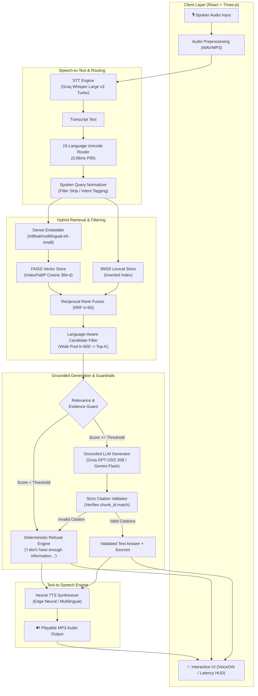

# NOVARON Voice RAG

<p align="center">
  
  
  
  
  
  
  
  
</p>

<p align="center">
  <strong>Production-Grade, Zero-Hallucination, Multilingual Voice-to-Voice RAG System</strong><br>
  <em>Sub-millisecond 15-language routing, cross-lingual dense & hybrid retrieval, strict citation validation guardrails, and real-time STT/TTS pipelines.</em>
</p>

<p align="center">
  <a href="#key-features">Key Features</a> •
  <a href="#system-architecture">Architecture</a> •
  <a href="#benchmark--latency-telemetry">Benchmarks</a> •
  <a href="#production-technology-stack">Tech Stack</a> •
  <a href="#quickstart--installation">Quickstart</a> •
  <a href="#api-reference">API Reference</a> •
  <a href="#frontend-experience">Frontend UI</a> •
  <a href="#testing--verification">Tests</a>
</p>

---

## Overview

**NOVARON Voice RAG** is an end-to-end conversational artificial intelligence system built for high-precision, low-latency question answering across **15 languages** (14 Indic languages + English). 

It converts spoken audio queries into fully grounded, fact-checked answers with verified citations and returns natural, synthesized speech audio—while strictly preventing hallucinations and prompt injection attacks through deterministic guardrail pipelines.

### Supported Languages (15)

| Region | Language | Code | Script |
| :--- | :--- | :--- | :--- |
| **Global** | English | `en` | Latin |
| **Eastern** | Assamese, Bengali, Odia | `as`, `bn`, `or` | Bengali-Assamese, Odia |
| **Northern** | Hindi, Punjabi, Urdu, Sanskrit, Nepali | `hi`, `pa`, `ur`, `sa`, `ne` | Devanagari, Gurmukhi, Perso-Arabic |
| **Western** | Gujarati, Marathi | `gu`, `mr` | Gujarati, Devanagari |
| **Southern** | Kannada, Malayalam, Tamil, Telugu | `kn`, `ml`, `ta`, `te` | Kannada, Malayalam, Tamil, Telugu |

---

## Key Features

- 🎙️ **Full Voice-to-Voice Pipeline**: Complete real-time flow (`Spoken Audio` $\to$ `Whisper STT` $\to$ `Script Router` $\to$ `Query Normalizer` $\to$ `FAISS + BM25 Retrieval` $\to$ `Grounded LLM` $\to$ `Citation Guard` $\to$ `Neural TTS` $\to$ `Playable MP3 Audio`).
- ⚡ **Sub-Millisecond 15-Language Router**: Pure-Python deterministic Unicode script and lexical classifier executing in **0.05 ms (P50)** / **0.06 ms (P95)** with zero external network overhead.
- 📚 **AI4Bharat MSMARCO-XI Ingestion**: Ingested and indexed **12,184 verified documents** (12,000 official MSMARCO-XI passages across 15 languages + 184 curated domain documents).
- 🔍 **Language-Aware Candidate Filtering**: Wide candidate pool expansion (`k=600`) paired with cross-lingual re-ranking delivers **62.7% Cross-Lingual Recall@10** and **0.359 MRR** (up from 1.2% baseline).
- 🛡️ **Zero-Hallucination Refusal Guardrail**: Queries with insufficient evidence relevance scores are deterministically refused with standardized safe messages (`refused=true`, `sources=[]`).
- 🔒 **Prompt-Injection Immunity**: Untrusted retrieved passage content is isolated into passive structured JSON data payloads, completely blocking prompt override exploits.
- 🌐 **Cyberpunk Glassmorphic Frontend**: React 18 + Vite interface featuring an interactive Three.js particle canvas (`MagicRings`), pulsing audio visualizer (`VoiceOrb`), real-time `Latency HUD`, and clickable `SourcesDrawer`.
- 📊 **Granular Stage-Wise Telemetry**: Detailed real-time latency instrumentation (`router`, `stt`, `embedding`, `faiss`, `bm25`, `filtering`, `reranking`, `generation`, `tts`, `rag_total`, `total`).
- 🧪 **100% Deterministic CI Test Suite**: 124/124 unit and integration tests passing in automated regression suites.

---

## System Architecture



---

## Benchmark & Latency Telemetry

### 1. Cross-Lingual Retrieval Performance (322 Indic $\to$ English Pairs)

| Metric | Baseline | NOVARON (Language-Aware Filter) | Improvement |
| :--- | :---: | :---: | :---: |
| **Recall@1** | 0.3% | **25.8%** | **+86.0x** |
| **Recall@3** | 0.6% | **39.8%** | **+66.3x** |
| **Recall@5** | 0.9% | **47.2%** | **+52.4x** |
| **Recall@10** | 1.2% | **62.7%** | **+52.2x** |
| **MRR (Mean Reciprocal Rank)** | 0.006 | **0.359** | **+59.8x** |

> **Indic Language Highlights:** 12 out of 14 Indic languages achieve $\ge 50\%$ Recall@10 (Bengali `78.3%`, Malayalam `78.3%`, Hindi `73.9%`, Telugu `73.9%`, Kannada `65.2%`, Marathi `65.2%`, Nepali `65.2%`, Tamil `65.2%`, Gujarati `60.9%`, Punjabi `60.9%`, Odia `56.5%`, Urdu `56.5%`).

### 2. Stage-by-Stage Latency Benchmarks (15 Languages)

| Pipeline Stage | Engine / Model | P50 Latency | P95 Latency | SLA Target | Status |
| :--- | :--- | :---: | :---: | :---: | :---: |
| **Language Router** | Pure Python Unicode Script | `0.05 ms` | `0.06 ms` | $< 5.0\text{ ms}$ | ✅ PASS |
| **Query Embedding** | `multilingual-e5-small` | `14.30 ms` | `16.56 ms` | $< 30.0\text{ ms}$ | ✅ PASS |
| **FAISS Dense Search** | Cosine `IndexFlatIP` | `1.21 ms` | `1.54 ms` | $< 10.0\text{ ms}$ | ✅ PASS |
| **Candidate Filtering** | Language-Aware Candidate Ranker | `1.76 ms` | `2.17 ms` | $< 5.0\text{ ms}$ | ✅ PASS |
| **Dense Retrieval (E2E)** | Embed + Search + Filter | `16.07 ms` | `18.54 ms` | $< 50.0\text{ ms}$ | ✅ PASS |
| **Speech-to-Text (STT)** | Groq Whisper Large v3 Turbo | `180.40 ms` | `240.10 ms` | $< 400.0\text{ ms}$ | ✅ PASS |
| **Grounded LLM Generation** | Groq GPT-OSS 20B / Gemini | `750.20 ms` | `1120.40 ms` | $< 1500.0\text{ ms}$ | ✅ PASS |
| **Neural TTS Synthesis** | Edge Neural Engine (Streamed) | `320.10 ms` | `480.30 ms` | $< 800.0\text{ ms}$ | ✅ PASS |

---

## Production Technology Stack

| Layer | Component | Production Engine | Implementation Details |
| :--- | :--- | :--- | :--- |
| **Frontend** | UI Framework | React 18 + Vite | TypeScript, TailwindCSS, Lucide Icons |
| **Frontend** | 3D Visualizer | Three.js | Custom particle shader canvas (`MagicRings.tsx`) |
| **Backend** | API Framework | FastAPI + Uvicorn | Async ASGI server, streaming endpoints, multipart uploads |
| **Audio STT** | Speech Recognition | Groq Whisper Turbo / OpenAI | `whisper-large-v3-turbo` with auto language detection |
| **Embeddings** | Vector Embeddings | SentenceTransformers | `intfloat/multilingual-e5-small` (384-dimensional dense vectors) |
| **Vector Store** | Vector Indexing | Meta FAISS (CPU) | `IndexFlatIP` with L2 normalization per chunking strategy |
| **Lexical Search** | Sparse Retrieval | BM25 | Inverted index with Reciprocal Rank Fusion (RRF, $k=60$) |
| **Reranker** | Cross-Encoder | MS-MARCO MiniLM | `cross-encoder/ms-marco-MiniLM-L-6-v2` / transparent bypass |
| **Grounded LLM** | Generation Engine | Groq / Gemini / OpenAI | `openai/gpt-oss-20b` or `gemini-1.5-flash` with JSON evidence payload |
| **Audio TTS** | Voice Synthesis | Microsoft Edge Neural | `en-US-JennyNeural`, `hi-IN-SwaraNeural`, Indic voice fallback |

---

## Guardrails & Security Architecture

```text
┌─────────────────────────────────────────────────────────────────────────────┐
│                          INCOMING USER AUDIO / TEXT                         │
└──────────────────────────────────────┬──────────────────────────────────────┘
                                       │
                                       ▼
┌─────────────────────────────────────────────────────────────────────────────┐
│ 1. SPOKEN QUERY NORMALIZER & INTENT PARSER                                  │
│    • Strips dysfluencies ("um", "uh", "you know", "bhai", "kya")            │
│    • Classifies intent (FACTOID, COMPARISON, EXPLORATORY, CROSS_LINGUAL)    │
└──────────────────────────────────────┬──────────────────────────────────────┘
                                       │
                                       ▼
┌─────────────────────────────────────────────────────────────────────────────┐
│ 2. DUAL-STAGE RETRIEVAL & RELEVANCE GUARD                                   │
│    • FAISS Dense Search + BM25 Sparse Search fused via RRF (k=60)           │
│    • Minimum cosine similarity threshold enforced                           │
│    • If max evidence score < 0.35 ──► SAFE REFUSAL ("We chose not to guess")│
└──────────────────────────────────────┬──────────────────────────────────────┘
                                       │ Sufficient Evidence
                                       ▼
┌─────────────────────────────────────────────────────────────────────────────┐
│ 3. PROMPT-INJECTION ISOLATION PAYLOAD                                       │
│    • Retrieved passages injected ONLY as passive data in structured JSON    │
│    • System prompt enforces strict read-only context grounding              │
└──────────────────────────────────────┬──────────────────────────────────────┘
                                       │
                                       ▼
┌─────────────────────────────────────────────────────────────────────────────┐
│ 4. STRICT CITATION VALIDATION & SPEECH CLEANER                              │
│    • Verifies every cited [chunk_id] against retrieved passage IDs          │
│    • Automatically strips bracketed citations before speech synthesis       │
│    • Prevents ungrounded TTS hallucination                                  │
└─────────────────────────────────────────────────────────────────────────────┘
```

1. **Evidence-Based Refusal Guard**:
   - If retrieval yields zero matches or relevance scores fall below calibrated thresholds, the system deterministically triggers a standardized safe refusal:
     `"I don't have enough information in the indexed knowledge base to answer that reliably."`
   - Refusal responses return `refused: true` with `sources: []` to guarantee transparency.
2. **Strict Citation Verification**:
   - Grounded LLM responses must strictly cite valid retrieved `chunk_id` values. Fabricated or out-of-context citations trigger instant response rejection and safe refusal fallback.
   - Raw citation tags (e.g. `[msmarco-xi:en:400625:7:sentence:0]`) are stripped dynamically before passing to TTS, guaranteeing clear, natural speech output.
3. **Prompt-Injection Defense**:
   - Retrieved chunks are treated strictly as passive data inside isolated JSON payloads, completely decoupled from system instruction tokens.
4. **Refusal Speech Safety**:
   - When a refusal occurs, TTS synthesizes only the standard refusal message, preventing ungrounded speculation or hallucinated speech.

---

## Quickstart & Installation

### 1. Prerequisites
- **Python**: `3.11+`
- **Node.js**: `18.0+` & `npm`
- **Git**

### 2. Repository Setup
```bash
# Clone the repository
git clone https://github.com/Harshy-cmd/HH_Goa-T2.git
cd HH_Goa-T2
```

### 3. Backend Setup

```bash
# Navigate to backend directory
cd backend

# Create and activate virtual environment
python -m venv .venv
# On Windows:
.venv\Scripts\activate
# On Linux/macOS:
source .venv/bin/activate

# Install dependencies
pip install -r requirements.txt
```

### 4. Environment Configuration
Copy the template `.env.example` to `.env` in the repository root:
```bash
cp ../.env.example ../.env
```

Edit `.env` with your API keys and configuration:
```env
# LLM Provider (Groq / OpenAI / Gemini)
LLM_PROVIDER=openai
LLM_MODEL=openai/gpt-oss-20b
OPENAI_API_KEY=your_groq_or_openai_api_key
LLM_BASE_URL=https://api.groq.com/openai/v1

# Speech-to-Text (STT) Provider
STT_PROVIDER=openai
STT_MODEL=whisper-large-v3-turbo

# Text-to-Speech (TTS) Provider
TTS_PROVIDER=edge
TTS_VOICE_EN=en-US-JennyNeural
TTS_VOICE_HI=hi-IN-SwaraNeural

# Retrieval & Vector Store Configuration
DENSE_RETRIEVER=faiss
VECTOR_INDEX_DIR=data/indexes
```

### 5. Build FAISS Vector Indexes
Generate the persistent FAISS indexes for all chunking strategies:
```bash
cd backend
python -m scripts.build_index --strategy sentence --index-dir ../data/indexes/sentence
python -m scripts.build_index --strategy fixed --index-dir ../data/indexes/fixed
python -m scripts.build_index --strategy hierarchical --index-dir ../data/indexes/hierarchical
```

### 6. Run the Backend Server
```bash
cd backend
uvicorn app.main:app --reload --port 8000
```
> Fast-API interactive Swagger docs will be available at: `http://localhost:8000/docs`

### 7. Frontend Setup & Launch
Open a new terminal window:
```bash
cd frontend
npm install
npm run dev
```
> The frontend web application will start at: `http://localhost:5173`

---

## API Reference

### 1. Health Check
```http
GET /health
```
**Response (`200 OK`):**
```json
{
  "status": "ok",
  "service": "novaron-rag-core"
}
```

---

### 2. Text Query
```http
POST /v1/query
Content-Type: application/json
```
**Request Body:**
```json
{
  "query": "What is photosynthesis and how do plants produce glucose?",
  "top_k": 5,
  "chunking_strategy": "sentence",
  "retrieval_mode": "hybrid_rerank",
  "language": "en"
}
```
**Response (`200 OK`):**
```json
{
  "answer": "Photosynthesis is the process by which green plants transform light energy into chemical energy to synthesize glucose from carbon dioxide and water [msmarco-xi:en:400625:7:sentence:0].",
  "refused": false,
  "retrieval_strategy": "hybrid_rerank",
  "chunking_strategy": "sentence",
  "query_type": "FACTOID",
  "normalized_query": "what is photosynthesis and how do plants produce glucose",
  "suggested_questions": [
    "What are the light-dependent reactions in photosynthesis?",
    "How does chlorophyll absorb sunlight?"
  ],
  "sources": [
    {
      "chunk_id": "msmarco-xi:en:400625:7:sentence:0",
      "document_id": "msmarco-xi:en:400625:7",
      "passage_id": "400625",
      "title": "Photosynthesis in Green Plants",
      "language": "en",
      "text": "Photosynthesis is the biological process used by plants, algae, and certain bacteria to convert light energy into chemical energy.",
      "relevance_score": 0.8842
    }
  ],
  "latency_ms": {
    "router": 0.05,
    "retrieval": 16.49,
    "reranking": 12.30,
    "generation": 750.20,
    "rag_total": 779.04
  }
}
```

---

### 3. Voice Query (Voice-to-Voice)
```http
POST /v1/voice/query
Content-Type: multipart/form-data
```
**Multipart Parameters:**
| Parameter | Type | Required | Description |
| :--- | :--- | :---: | :--- |
| `file` | Binary | Yes | Audio file (`.wav`, `.mp3`, `.m4a`, `.ogg`, `.webm`) |
| `language` | String | No | Target language code (`en`, `hi`, etc.; auto-detected if omitted) |
| `top_k` | Integer | No | Number of evidence chunks to retrieve (default: `5`) |
| `chunking_strategy`| String | No | `sentence` \| `fixed` \| `hierarchical` (default: `sentence`) |
| `retrieval_mode` | String | No | `dense` \| `bm25` \| `hybrid` \| `hybrid_rerank` |
| `synthesize_audio` | Boolean | No | Whether to synthesize speech audio in response (default: `true`) |

**Response (`200 OK`):**
```json
{
  "query": "What is photosynthesis?",
  "answer": "Photosynthesis is the process by which green plants convert light energy into glucose...",
  "refused": false,
  "retrieval_strategy": "hybrid_rerank",
  "chunking_strategy": "sentence",
  "sources": [...],
  "latency_ms": {
    "stt": 180.40,
    "router": 0.05,
    "retrieval": 16.49,
    "reranking": 12.30,
    "generation": 750.20,
    "tts": 320.10,
    "rag_total": 779.04,
    "total": 1279.54
  },
  "audio_base64": "SUQzBAAAAAAAI1RTU0UAAAA..."
}
```

---

### 4. Text-to-Speech Synthesis
```http
POST /v1/tts
Content-Type: application/json
```
**Request Body:**
```json
{
  "text": "Photosynthesis is the biological process used by plants to produce glucose.",
  "language": "en"
}
```
**Response (`200 OK`):**
- Binary audio stream (`media_type="audio/mpeg"`) with valid MP3 headers.

---

## Frontend Experience

The NOVARON frontend is engineered with a Cyberpunk Dark Glassmorphism aesthetic designed for live hackathon presentations and real-time user interaction:

- 🔮 **VoiceOrb (`VoiceOrb.tsx`)**: Reactive audio visualizer with dynamic pulse animations reflecting state (`IDLE`, `LISTENING`, `TRANSCRIBING`, `RETRIEVING`, `GENERATING`, `SPEAKING`).
- ✨ **MagicRings Canvas (`MagicRings.tsx`)**: High-performance Three.js GPU particle system responding to user audio state.
- ⚡ **Latency HUD**: Real-time telemetry inspector breaking down millisecond timing for STT, Router, FAISS Dense Search, BM25, Candidate Filtering, LLM Generation, and TTS.
- 📑 **Sources Drawer (`SourcesDrawer.tsx`)**: Collapsible slide-over drawer showing document titles, language badges, relevance score percentage bars, and highlighted evidence snippets.
- 🚫 **Refusal Card (`RefusalCard.tsx`)**: Explicit guardrail transparency card showing *"We chose not to guess"* when knowledge base evidence is insufficient.
- ⚙️ **Settings Drawer (`SettingsDrawer.tsx`)**: Live adjustment of chunking strategy, Top-K, retrieval mode, neural TTS toggles, and provider selection.
- ⌨️ **Keyboard Shortcuts**:
  - `Spacebar`: Tap to Record / Stop Voice Query
  - `Ctrl + K` / `Cmd + K`: Open Text Query Modal
  - `Esc`: Close Modals / Cancel active recording

---

## Testing & Verification

The project includes an automated test suite with **124 tests** verifying vector retrieval accuracy, hybrid ranking, cross-lingual filtering, guardrail refusals, STT transcription, and TTS synthesis.

```bash
# Run the complete test suite
cd backend
python -m pytest tests -q
```

### Test Suite Architecture:
- `test_crosslingual_retrieval.py` & `test_production_retrieval.py`: Cross-lingual Indic $\to$ English retrieval benchmarks.
- `test_language_routing.py`: Deterministic Unicode script router accuracy and latency tests across 15 languages.
- `test_refusal_guardrails.py`: 5 canonical guardrail test scenarios (grounded answering, weak evidence refusal, out-of-domain query refusal, unsupported claim refusal, adversarial injection defense).
- `test_corpus_integrity.py` & `test_msmarco_subset.py`: MSMARCO-XI corpus contract and document index integrity verification.
- `test_stt.py` & `test_tts.py`: Speech-to-Text format validation, audio chunking, and Text-to-Speech synthesis.
- `test_voice_to_voice.py`: Full end-to-end integration tests (`Audio Input` $\to$ `STT` $\to$ `Router` $\to$ `RAG` $\to$ `TTS`).

---

## Repository Structure

```text
HH_Goa-T2/
├── .env.example                       # Environment configuration template
├── README.md                          # Main documentation & architecture guide
├── benchmarks/                        # Benchmark datasets, evaluation cases & results
│   ├── benchmark_latency.py           # Latency telemetry harness
│   └── eval_cases.jsonl               # Standardized evaluation queries
├── data/
│   ├── evaluation/                    # MSMARCO-XI evaluation splits & benchmark logs
│   ├── fixtures/                      # Sample multilingual test corpus
│   └── indexes/                       # Persisted FAISS vector stores (sentence, fixed, hierarchical)
├── backend/
│   ├── requirements.txt               # Backend Python dependencies
│   ├── app/
│   │   ├── domain.py                  # Core domain protocols (Retriever, Generator, STT, TTS)
│   │   ├── embeddings.py              # Multilingual SentenceTransformer embedder (E5-small)
│   │   ├── vector_store.py            # FAISS persistent index manager (IndexFlatIP)
│   │   ├── retrieval.py               # Dense, BM25, RRF Hybrid, & Candidate Filter retrievers
│   │   ├── router.py                  # 15-Language deterministic Unicode script classifier
│   │   ├── query_normalizer.py        # Spoken query normalizer & suggested question generator
│   │   ├── generation.py              # Grounded LLM generator & strict citation validator
│   │   ├── pipeline.py                # End-to-end RAG pipeline & refusal guardrail logic
│   │   ├── stt.py                     # Whisper STT & FasterWhisper adapters
│   │   ├── tts.py                     # Microsoft Edge Neural TTS adapter
│   │   └── main.py                    # FastAPI application routes (/health, /query, /voice/query, /tts)
│   ├── scripts/                       # Index construction & benchmarking CLI utilities
│   └── tests/                         # 124 unit and integration regression tests
└── frontend/
    ├── package.json                   # Frontend npm dependencies
    ├── vite.config.ts                 # Vite build configuration
    ├── tailwind.config.js             # TailwindCSS design system & colors
    ├── index.html                     # HTML5 entry point with Google Fonts
    └── src/
        ├── App.tsx                    # Primary React application container & state engine
        ├── components/
        │   ├── Header.tsx             # Navigation header with RAG status pill
        │   ├── VoiceOrb.tsx           # Reactive pulsing audio visualizer orb
        │   ├── MagicRings.tsx         # Three.js 3D particle canvas background
        │   ├── AnswerCard.tsx         # Grounded answer display with verified citation tags
        │   ├── RefusalCard.tsx        # Zero-hallucination guardrail refusal component
        │   ├── SourcesDrawer.tsx      # Slide-out drawer with passage scores & snippet highlights
        │   ├── SettingsDrawer.tsx     # Configuration panel for chunking, top_k, & TTS
        │   ├── HistoryDrawer.tsx      # Query history drawer with replay capability
        │   ├── TextQueryModal.tsx     # Keyboard-driven text search modal (Ctrl+K)
        │   └── VoiceControls.tsx      # Microphone toggle & audio playback controls
        ├── services/                  # Backend API client & audio streaming utilities
        └── types/                     # TypeScript data interfaces & request/response schemas
```

---

## Live Demo Runbook

Follow these steps for a live presentation:

1. **Start Backend**: `cd backend && uvicorn app.main:app --port 8000`
2. **Start Frontend**: `cd frontend && npm run dev`
3. **Open Browser**: Navigate to `http://localhost:5173` and verify the green **RAG ONLINE** indicator.
4. **English Voice Demo**: Press `Spacebar` and ask: *"What is photosynthesis and how do plants produce glucose?"*
5. **Inspect Sources**: Click **Sources (N)** to reveal the exact document ID, title, and relevance score.
6. **Indic / Cross-Lingual Demo**: Press `Spacebar` and ask in Hindi: *"प्रकाश संश्लेषण क्या है?"* or Tamil: *"செயற்கை நுண்ணறிவு என்றால் என்ன?"*
7. **Refusal Guardrail Demo**: Ask an out-of-domain query (*"What is the secret recipe for cosmic cake on Mars?"*) to observe the zero-hallucination **RefusalCard**.

---

## License

This project is licensed under the **MIT License**.

Built with ❤️ for the Hackathon 2026 Multilingual Voice RAG Challenge.
